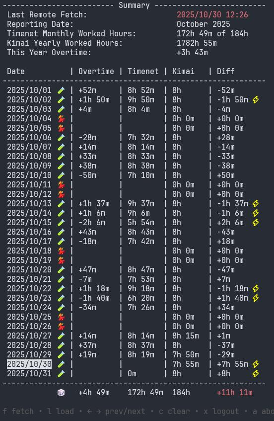

Practical Golang utility to manage you logged hours using Timenet and Kimai.

<div align="center"></div>

<p>&nbsp;</p>
<p align="center">
  <a href="https://github.com/fabriziotappero/timo/releases/"><b>DOWNLOAD LASTEST VERSION</b></a>
</p>

## Basic Principles
- Terminal-style application usable as double-click Windows app too.
- Handles login and dynamically scraping.
- Run Kimai and Timenet scraping in parallel in background.
- All scraped data is stored locally in JSON files.
- Simple and intuitive report generation from JSON files.
- Automatically check for new version comparing version from github main branch.

## How Timo Works

Timo is a Terminal program written in Go and compiled for both Linux and Windows. It uses 
The Charm TUI library for visualization and chromedp (which requires Chrome or Chromium) for 
dynamic scraping the Kimai and the Timenet URLs.

Since your OS might not have any flavour of Chrome installed. A basic check is done the first time
Time os run on your OS. If needed, Chromium is installed in `~/.config/timo/` on Linux or in
 `~\AppData\Roaming\timo\` on Windows.

Once remote HTML information scraped, DOM parsing is done using the
`github.com/PuerkitoBio/goquery` library.

Local JSON data is processed on user request and presented to the UI in a concise manner.

Log data is stored in `timo_debug.log` and all scraped information is stored in JSON files. All is 
located in the OS temporary folder ``~/tmp/`` in Linux or `~\AppData\Local\Temp\` in Windows.

The `build.sh` script can be used for local builds. **Githib Actions** build process is triggered by 
adding the *new_release* git tag. Software version is defined in `build.sh` and is used at boot to
check for new version availability.

While developing it is quite useful to compile and run using the command `go run . --debug`. This
will generate more detailed log information. Log can be monitored using `tail -f /tmp/timo_debug.log`.

Github is used to store the timo repository. A new build is triggered by Gihub Actions when
the lastest master is tag with *"release"*.

## Some Help With Golang

https://go.dev/doc/effective_go

Run the app while developing: 

```
go mod init timo
go mod tidy
go run . --debug
```
Build the project:

```
# 64-bit Windows
go env -w GOOS=windows GOARCH=amd64; go build -o build/timo.exe .

# Linux
go env -w GOOS=linux GOARCH=amd64; go build -o build/timo .
```
